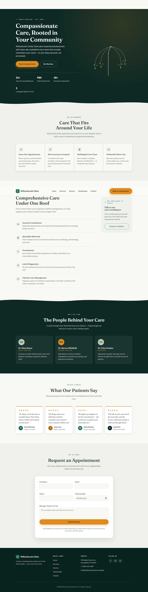

# Healthcare Website — Willowbrook Family Clinic

A single-page, responsive healthcare clinic landing page. Pure HTML, CSS, and vanilla
JavaScript in one `index.html` file — no framework, no build step, no dependencies.

**Live site:** https://christabelletan21.github.io/healthcare-website/

## Preview



## Features

- Sticky, responsive navbar with mobile hamburger menu and smooth-scroll anchor links
- Hero section with an animated willow-tree line illustration, headline, and a
  trust-indicator strip
- "Why Willowbrook" trust tiles, an editorial services list, a "Meet the Team" doctor
  directory, and patient testimonials with star ratings and initials avatars
- Appointment enquiry form with client-side validation (required fields, email format,
  phone format), inline error messages, and a success confirmation — no backend required
  (submission is logged to the browser console, with a marked spot to wire up a real API)
- Footer with contact details, quick links, social placeholders, and an auto-updating
  copyright year
- Custom SVG icon set (no emoji), organic wave dividers between sections, dark-mode-aware
  color tokens, `prefers-reduced-motion` support, semantic HTML5, and keyboard-friendly
  navigation

## Tech Stack

HTML5 · CSS3 · Vanilla JavaScript — no frameworks, no build tooling.

## Running Locally

Just open `index.html` in a browser. There is nothing to install or build.

## Deployment

Deployed automatically to GitHub Pages via GitHub Actions
(`.github/workflows/pages.yml`) on every push to `main`.

## Project Structure

```
healthcare-website/
├── index.html      # entire site: markup, styles, and script
├── screenshot.png  # preview image used in this README
└── .github/workflows/pages.yml
```

## License

MIT
